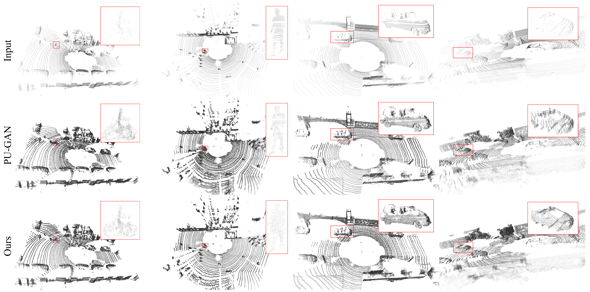

# PU-CycGAN

**WEAKLY SUPERVISED POINT CLOUD UPSAMPLING VIA OPTIMAL TRANSPORT**

(Official TensorFlow Implemention, the code is modified from [PU-GAN](https://github.com/liruihui/PU-GAN))

## Introduction

Existing learing-based methods usually train a point cloud upsampling model with synthesized, paired sparse-dense point clouds, and then directly use the trained model to process the real-scanned sparse point clouds. This limits their performance and application in the real world. To solve this problem, we propose PU-CycGAN, a point cloud upsampling method based on optimal transport theory (OT). It can be directly trained with real sparse point cloud so that the gap between the training and test data can be filled. Specifically, PU-CycGAN consists of a Denser, Sparser and two discriminators. The discriminator is used to calculate the quadratic Wasserstein distance, Sparser generates realistic sparse point clouds for Denser, and the Denser upsamples the sparse point cloud in an unsupervised way. Extensive experiments on both synthetic and real-scanned datasets show that our method is effective in distribution uniformity, underlying surface representation and applicability to data in the wild.

## Results
* PU1K dataset

    

* KITTI dataset

    


## Installation

* Create conda virtual environment

    ```shell
    # The recommended Python version is 3.6
    conda create --name pucycgan python=3.6
    conda activate pucycgan
    # Install TensorFlow
    conda install tensorflow-gpu=1.13.1
    # Some warnings can be avoided by using numpy < 1.17
    conda install numpy=1.16.6
    ```

* Compiling TF operators

    1. Check the `tf_XXX_compile.sh` script in each sub file under the `tf_ops`directory, and modify the location of the Python interpreter, CUDA runtime API and TensorFlow in the shell script to correspond to the local machine.
    2. Execute each `tf_xxx_compile.sh` successively, or copy`compile.sh` from `docker` directory to `tf_ops` directory for execution; Then execute the `compile_render_balls_so.sh` script

See the [中文说明](Docs/USAGE-CN.md) for detailed operation.

## Usage

1. Clone the repository:

    ```bash
    git clone https://github.com/cognaclee/PU-CycGAN
    cd PU-CycGAN
    ```

2. Training
Download PU-GAN or our training dataset we collected from [KITTI](http://www.cvlibs.net/datasets/kitti/) and [Semantic3d](http://www.semantic3d.net) (we also organize the data into HDF5 files, and the keys of the dataset is `Kitti` and `semantic3d`) from [Google Drive](https://drive.google.com/drive/folders/1SJhQmvLe53aKAJR_EOcKgr323DeZYiNR?usp=sharing) and then put it in the `data` folder.

    ```bash
    python pu_gan.py --phase=train
    ```

3. Testing
Download PU-GAN or our testing dataset from [Google Drive](https://drive.google.com/drive/folders/1SJhQmvLe53aKAJR_EOcKgr323DeZYiNR?usp=sharing) and put it into the `data` folder.

    ```bash
    python pu_gan.py --phase=test --data_dir=path/to/testing/dataset --out_folder=path/to/output/folder
    ```

4. Evaluation

    ```bash
    # calculate the uniform metric
    cd evaluation_code
    cmake .
    make
    # The second argument is the mesh, and the third one is the predicted points
    ./evaluation Icosahedron.off Icosahedron.xyz

    python evaluate.py --gt=path/to/groundtruth --pred=/path/to/prediction
    ```

   The results are saved in `evaluation.csv` in the folder where the prediction file is located.

## Citation
