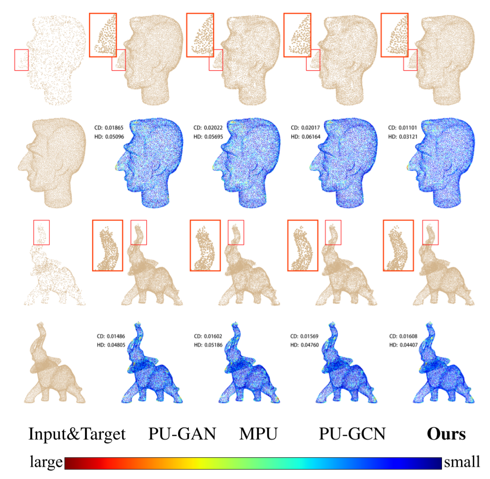

# PU-CycGAN

**WEAKLY SUPERVISED POINT CLOUD UPSAMPLING VIA OPTIMAL TRANSPORT**

(Official TensorFlow Implemention, the code is modified from [PU-GAN](https://github.com/liruihui/PU-GAN))

## Introduction

Existing learning-based methods usually train a point cloud upsampling model with synthesized, paired sparse-dense point clouds. However, the distribution gap between synthe-
sized and real data limits the performance and generalization. To solve this problem, we innovatively regard the upsamplig task as an optimal transport (OT) problem from sparse to dense point cloud. Further we propose PU-CycGAN, a cycle network that consists of a Densifier, Sparsifier and two discriminators. It can be directly trained for upsampling
with unpaired real sparse point clouds, so that the distribution gap can be filled via the learning. Especially, quadratic Wasserstein distance is introduced for the stable training.

## Results
* PU1K dataset

    

* KITTI dataset

    


## Installation

* Create conda virtual environment

    ```shell
    # The recommended Python version is 3.6
    conda create --name pucycgan python=3.6
    conda activate pucycgan
    # Install TensorFlow
    conda install tensorflow-gpu=1.13.1
    # Some warnings can be avoided by using numpy < 1.17
    conda install numpy=1.16.6
    ```

* Compiling TF operators

    1. Check the `tf_XXX_compile.sh` script in each sub file under the `tf_ops`directory, and modify the location of the Python interpreter, CUDA runtime API and TensorFlow in the shell script to correspond to the local machine.
    2. Execute each `tf_xxx_compile.sh` successively, or copy`compile.sh` from `docker` directory to `tf_ops` directory for execution; Then execute the `compile_render_balls_so.sh` script


## Usage

1. Clone the repository:

    ```bash
    git clone https://github.com/cognaclee/PU-CycGAN
    cd PU-CycGAN
    ```

2. Training

    Download PU-GAN or our training dataset we collected from [KITTI](http://www.cvlibs.net/datasets/kitti/) and [Semantic3d](http://www.semantic3d.net) (we also organize the data into HDF5 files, and the keys of the dataset is `Kitti` and `semantic3d`) from [Google Drive](https://drive.google.com/drive/folders/1SJhQmvLe53aKAJR_EOcKgr323DeZYiNR?usp=sharing) and then put it in the `data` folder.

    ```bash
    python pu_gan.py --phase=train
    ```

3. Testing

    Download PU-GAN or our testing dataset from [Google Drive](https://drive.google.com/drive/folders/1SJhQmvLe53aKAJR_EOcKgr323DeZYiNR?usp=sharing) and put it into the `data` folder.

    ```bash
    python pu_gan.py --phase=test --data_dir=path/to/testing/dataset --log_dir=path/to/trained/model --out_folder=path/to/output/folder
    ```

4. Evaluation

    ```bash
    # calculate the uniform metric
    cd evaluation_code
    cmake .
    make
    # The second argument is the mesh, and the third one is the predicted points
    ./evaluation Icosahedron.off Icosahedron.xyz

    python evaluate.py --gt=path/to/groundtruth --pred=/path/to/prediction
    ```

   The results are saved in `evaluation.csv` in the folder where the prediction file is located.

## Citation
